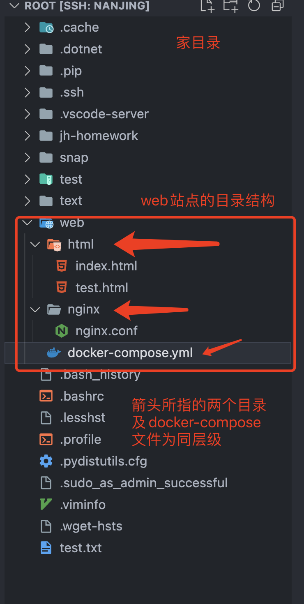

# 如何在服务器部署自己的网站

### 服务器购买及连接配置

1. 阿里云或腾讯云皆可
2. 选择操作系统，推荐Ubuntu 22.04
3. 选择配置，轻量型应用服务器即可满足需求
4. 使用控制台直接连接服务器，进行密钥配置


服务器在控制台登录为非root用户，切换为root用户
```bash
sudo -i
```
在服务器 `~/.ssh`目录下，创建 `authorized_keys`文件，将本地的公钥复制到该文件中，即可实现免密登录。
```bash
cd .ssh
vi authorized_keys
# 将公钥复制到该文件中，保存退出
```
查看本地公钥
```
cat ~/.ssh/id_ed25519.pub
```
如本地没有公钥，可使用以下命令生成：
```bash
# 生成公钥，在本机终端执行 ed25519
ssh-keygen -t ed25519 -C "邮箱"
# 默认生成在 ~/.ssh 目录下，后续选项回车即可
```

配置完成后即可使用ssh命令免密登录服务器, 打开本地终端，输入以下命令：
```bash
ssh root@服务器ip/域名
```

登录上服务器之后即可像本地一样使用服务器，安装软件，配置环境等。服务器和本机电脑在本质上并无区别，只是缺少了图形化界面，所有操作都需要在终端中完成。

配置别名ssh连接（可选）
在本地终端中，打开 `~/.ssh/config`文件
```bash
vi ~/.ssh/config
```
在文件中添加以下内容
```
Host 别名
  HostName IP地址或域名
  User root
  ForwardAgent yes
```
保存退出后，即可使用以下命令连接服务器
```bash
ssh 别名
```
**别名可自定义，方便记忆即可，使用英文**

备注：
1. 服务器随便玩，别干坏事、成年人了，自己负责
2. 搞技术放心大胆折腾，别怕玩坏，大不了在控制台重装系统
3. 重装系统后，需要删除本地 `~/.ssh/known_hosts`文件中的服务器记录，否则会报错无法连接

### 域名解析

1. 在阿里云或腾讯云购买域名
2. 在控制台中找到域名、选择域名列表、列表操作箱选择解析
3. 添加解析记录，记录类型选择A记录，主机记录填写域名前缀，记录值填写服务器ip地址

例如：
买的域名为：yujian.cool
主机记录：jhun
记录值：服务器ip地址(例如：43.138.32.12)
那么访问地址为：jhun.yujian.cool，对应的ip就是43.138.32.12

### 服务器环境配置
1. 更新软件源
```bash
apt update
```
2. 安装docker、docker-compose
```bash
apt install docker.io docker-compose
```
3. 安装git
```bash
# 查看git版本，确认是否已安装
git --version
# 如提示未安装，执行以下命令安装
apt install git
```
4. 使用docker部署nginx服务
a. 在服务器上创建文件夹，用于存放网站文件(在家目录下即可)
```bash
mkdir web
```
b. 在web文件夹下创建nginx配置文件夹
```bash
cd web
mkdir nginx
```
c. 在nginx文件夹下创建nginx配置文件
```bash
cd nginx
vi nginx.conf
```
d. 在nginx.conf文件中添加以下内容
```
server {
    listen 80; # 监听80端口
    server_name jhun.yujian.cool; # 域名，可以写多个，用空格隔开
    root /html; # 网站文件存放目录
    index index.html; # 默认访问文件
    location / {
        try_files $uri $uri/ /index.html; # 路由重定向到index.html
    }
}
```
注：nginx配置有新增或者修改，需要重启nginx服务才能生效
```bash
cd ~/web
docker-compose restart
```
e. 在web文件夹下创建html文件夹，用于存放网站文件
```bash
cd ~/web
mkdir html
```
f. 在html文件夹下创建index.html文件，用于测试
```bash
cd html
vi index.html
```
添加html内容，保存退出
f. 在web文件夹下创建docker-compose.yml文件，用于启动nginx服务
```bash
cd ~/web
vi docker-compose.yml
```
添加以下内容，保存退出
```yml
version: '3.1' # docker-compose版本
services: # 服务列表
    webserver: # 服务名称
        image: 'nginx:alpine' # nginx镜像
        working_dir: /application # 工作目录
        volumes: # 挂载目录
            - './nginx:/etc/nginx/conf.d' # 挂载nginx配置文件
            - './html/:/html' # 挂载网站文件
        ports:
            - '80:80' # 端口映射 服务器端口:容器端口
        restart: always # 重启策略

```

g. 启动nginx服务
```bash
cd ~/web
docker-compose up -d
```
h. 访问域名，查看是否成功部署
备注： 在html文件夹下，添加自己的网站文件，即可在服务器上部署自己的网站，访问域名+/文件名 即可查看效果，index.html文件为输入域名时默认访问的文件，如有其他文件，可通过域名+/文件名访问，例如在html文件夹下创建test.html文件，访问域名+/test.html即可查看效果（http://jhun.yujian.cool/test.html）

目录结构效果图：
